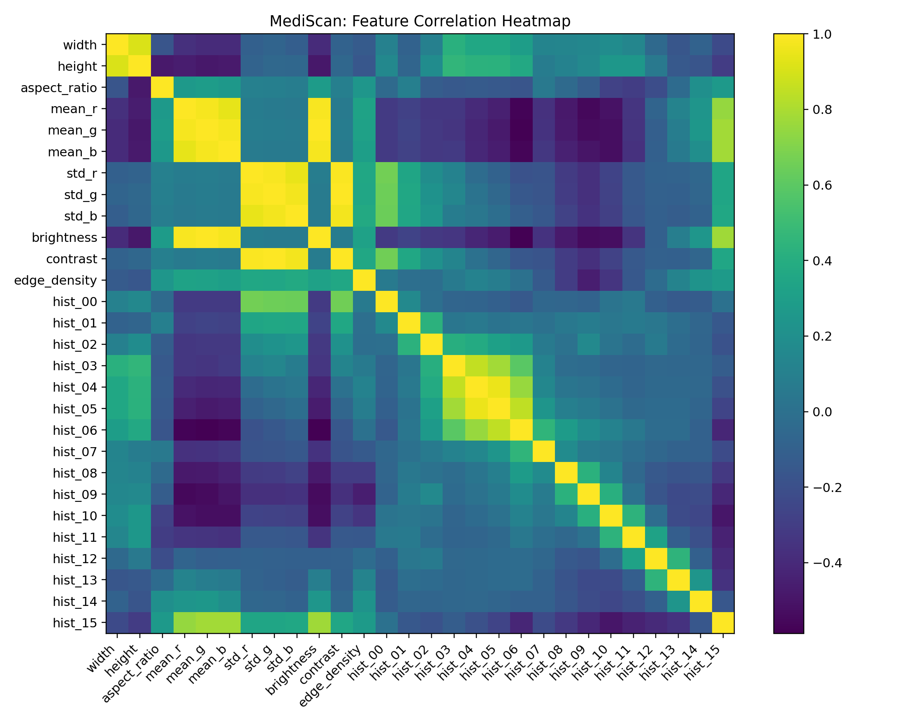

🧾 MediScan — Pseudo‑Label Prediction & Heatmaps (Image OCR Prep)

MediScan turns a folder of scanned prescription images into useful numerical features, learns pseudo‑labels with K‑Means (unsupervised), trains a multinomial classifier to predict those labels, and saves predictions + heatmaps for quick exploration.

This is ideal when you don’t have ground‑truth classes yet but want to validate an OCR/vision pipeline, cluster data quality, or bootstrap weak labels.

📂 What this repo/script does

Feature extraction per image:

width, height, aspect ratio

RGB mean/std, grayscale brightness/contrast

Edge density (Canny)

Grayscale histogram (16 bins, L1‑normalized)

Unsupervised clustering: K‑Means → pseudo‑labels (2–3 clusters depending on dataset size)

Classifier: StandardScaler + Logistic Regression (multinomial) trained to predict those pseudo‑labels

Artifacts & visualizations:

medi_scan_features.csv — full feature table

medi_scan_feature_corr_heatmap.png — correlation heatmap of features

medi_scan_confusion_heatmap.png — confusion matrix (classifier vs pseudo‑labels)

medi_scan_predictions.csv — predicted cluster & probabilities per image

medi_scan_model.pkl — saved scikit‑learn pipeline (scaler + logistic regression)

🗺️ Paths

Input images (recursive):
C:\Users\sagni\Downloads\MediScan\archive\data

Outputs:
C:\Users\sagni\Downloads\MediScan

You can change these in the script by editing IN_DIR and OUT_DIR.

⚙️ Requirements
pip install pandas numpy pillow scikit-learn scikit-image matplotlib joblib

pillow: image loading

scikit‑image: grayscale + Canny edges

scikit‑learn: KMeans + LogisticRegression + pipeline

matplotlib: heatmaps/plots

joblib: save the trained pipeline

🚀 Quickstart

Save the full script from the chat as, e.g., medi_scan_predict.py.

Run (PowerShell):

python medi_scan_predict.py

Open the results in C:\Users\sagni\Downloads\MediScan:

medi_scan_features.csv

medi_scan_feature_corr_heatmap.png

medi_scan_confusion_heatmap.png

medi_scan_predictions.csv

medi_scan_model.pkl

🧠 How it works

Extract features:
Each image → numeric vector capturing size, color stats, brightness/contrast, edges, and a coarse grayscale histogram.

Cluster (pseudo‑labels):
We run K‑Means (k=2 or 3 depending on dataset size) to group images by visual similarity. These cluster IDs are our pseudo‑labels.

Train classifier:
A StandardScaler + multinomial Logistic Regression is trained to predict the pseudo‑labels. This helps check whether your features linearly separate the clusters and provides a fast inference model.

Predict & visualize:

We predict a label + probability for every image, save a CSV with per‑cluster probabilities, and draw:

Feature correlation heatmap (are features redundant/co‑varying?)

Confusion matrix heatmap (how well classifier reproduces K‑Means labels on a held‑out set)

Because labels are unsupervised, the confusion matrix is relative to K‑Means, not ground truth. When you have real labels, just swap them in to get true supervised metrics.

📄 Output files (what to look at)

medi_scan_features.csv
One row per image with all numeric features. Great for quick EDA in Excel/Sheets.

medi_scan_feature_corr_heatmap.png
Visual check of feature collinearity; e.g., brightness vs. histogram bins.

medi_scan_confusion_heatmap.png
Agreement between the classifier and K‑Means pseudo‑labels on the test split.

medi_scan_predictions.csv

pred_cluster — predicted cluster ID (e.g., 0/1/2)

pred_prob — max probability

prob_C* — per‑cluster probability columns

top3 — quick view of the top‑3 cluster confidences

medi_scan_model.pkl
Use with joblib.load to classify new images after extracting the same features.

🧪 Switching to real labels

If you later annotate images with real classes (e.g., prescription type, template, language):

Replace this line (pseudo‑labels):

pseudo_labels = kmeans.fit_predict(X_all)

with your ground‑truth label vector:

y_true = your_label_array  # e.g., loaded from CSV

Train/test split and the rest of the pipeline remains the same.

Your confusion heatmap now reflects true supervised performance.

🔧 Customization

Number of histogram bins: change hist_bins in extract_features_one (default 16).

K‑Means k: set a fixed k if you know your classes.

Classifier: swap LogisticRegression for LinearSVC or RandomForestClassifier.

Features: add EXIF fields, entropy, text‑density proxies (after OCR), etc.

🐞 Troubleshooting

“No images found”: Confirm extensions and the IN_DIR path. Defaults include jpg/jpeg/png/tif/tiff/bmp/webp.

Slow on very large images: Reduce the edge‑resize size (default shortest side → 256 px) for Canny.

Weird heatmaps: Check medi_scan_features.csv for NaNs; very small or corrupt images may get filtered out.

🧱 Suggested project structure
MediScan/
├─ archive/
│  └─ data/                         # your input images (recursive)
├─ medi_scan_predict.py             # the script from this README
├─ medi_scan_features.csv           # (generated)
├─ medi_scan_feature_corr_heatmap.png
├─ medi_scan_confusion_heatmap.png
├─ medi_scan_predictions.csv
└─ medi_scan_model.pkl

Author

SAGNIK PATRA
